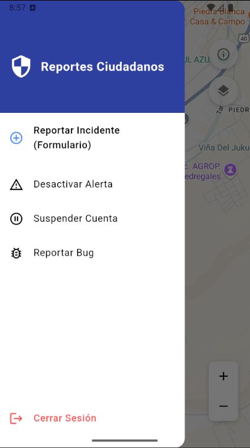
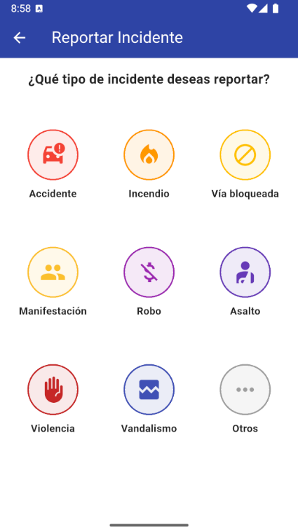
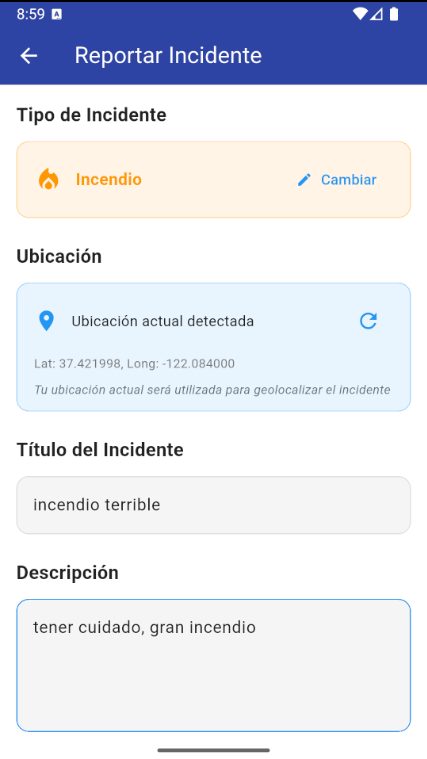
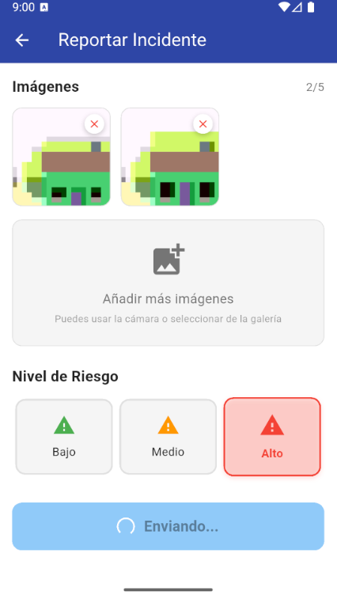
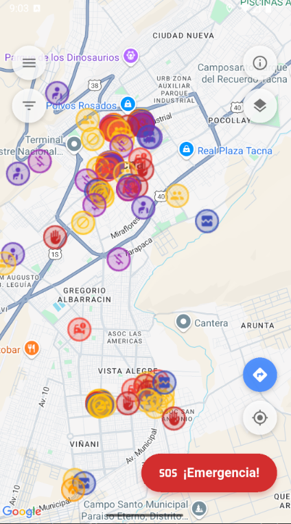

# 🧪 Examen Unidad II - Práctica  
**Universidad Privada de Tacna – 2025**  
**Curso:** Soluciones Móviles II  
**Nombre:** CUTIPA GUTIERREZ, RICARDO DANIEL  
**Código:** 2021069827

---
## 🔗 Enlace del Repositorio

Puedes acceder al código fuente completo del proyecto en el siguiente enlace público de GitHub:

[SM2_EXAMEN_PRACTICO - Ricardo Cutipa](https://github.com/RicardoCutipa/SM2_EXAMEN_PRACTICO)

---
## 🔐 Credenciales de Acceso

Para facilitar la revisión del proyecto, puedes iniciar sesión con las siguientes credenciales de prueba:

- **Correo:** admin@gmail.com  
- **Contraseña:** admin123

También puedes crear un nuevo usuario utilizando el apartado de **"Registrarse"** en la pantalla de inicio de sesión.

---

## 📲 Descripción del Proyecto

Esta aplicación móvil está orientada a fortalecer la seguridad comunitaria, permitiendo a los ciudadanos tanto **reportar incidentes** como **visualizar eventos recientes** directamente desde un mapa interactivo.

En esta práctica se desarrollaron las siguientes dos historias del Product Backlog:

---

## ✅ Historias Implementadas

### 🔹 H10 - Enviar Reportes Comunitarios

**Historia de usuario:**  
Como ciudadano comprometido con la seguridad de mi comunidad, quiero poder reportar incidentes que observe o experimente, mediante un formulario intuitivo que me permita especificar el tipo de incidente, ubicación, hora, descripción detallada y adjuntar evidencia fotográfica opcional, para contribuir a la seguridad colectiva y alertar a otros usuarios sobre peligros recientes.

**Proceso funcional:**

- El usuario accede al menú lateral después de iniciar sesión.
- Selecciona la opción **"Generar Reporte"**.
- Aparece una lista con categorías de incidentes.
- Luego, se muestra un formulario donde el usuario debe ingresar:
  - Título del reporte.
  - Descripción.
  - Nivel de gravedad (bajo, medio o alto).
  - Imágenes (opcional).
- Finalmente, presiona el botón "Enviar reporte" y el reporte se almacena en la base de datos.

📸 *Paso a paso en capturas:*
**1. Selección de Categoría de Reporte**  

**2. Formulario para Ingresar Detalles del Reporte**  

**3. Visualización de Marcadores en el Mapa**  

**4. Aplicación de Filtros Temporales en el Mapa**  

---
### 🔹 H12 - Visualización de Marcadores Temporales

**Historia de usuario:**  
Como usuario que consulta el mapa de la ciudad, quiero ver indicadores visuales (marcadores) que señalen dónde han ocurrido incidentes de seguridad reportados recientemente por la comunidad y filtrarlos según el tiempo, para tener mejor contexto en tiempo real.

**Proceso funcional:**

- El usuario se encuentra en la vista principal del mapa.
- Toca el botón de capas, lo cual activa la visualización de marcadores.
- Se muestran reportes recientes como marcadores con íconos representativos del tipo de incidente.
- El usuario puede aplicar filtros por tiempo:
  - Última hora.
  - Últimas 12 horas.
  - Últimas 24 horas.
  - Todos los reportes disponibles.

> **Nota:** Esta historia de usuario no incluye la función de hacer clic en los marcadores para ver más detalles.

📸 *Capturas:*

**1. Vista General del Mapa**  

---
## 📚 Enlaces y Referencias

- **Firebase:** Utilizado como backend para almacenar los reportes generados por los usuarios.
- **Dart:** Lenguaje de programación usado en conjunto con Flutter para construir la app.
- **API de Imgbb:** Utilizada para subir y alojar imágenes externas de los reportes.

---

## ⚙️ Consideraciones Técnicas

- No es necesario instalar paquetes o librerías adicionales manualmente.
- Solo se debe **compilar el proyecto en una APK** para poder instalarlo y probarlo en un dispositivo Android real o emulador.

